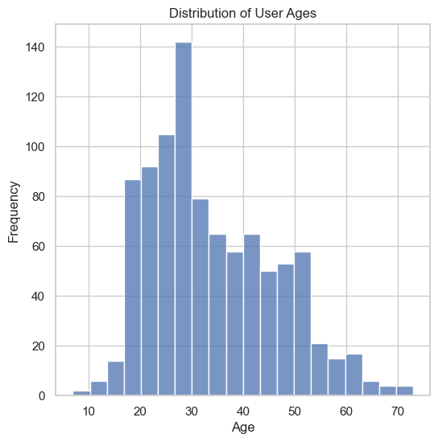
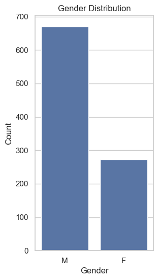
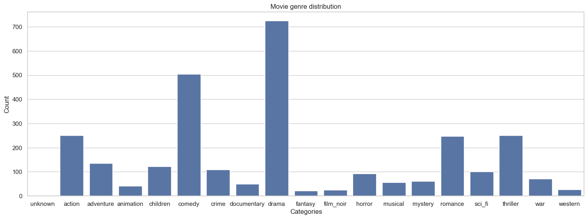
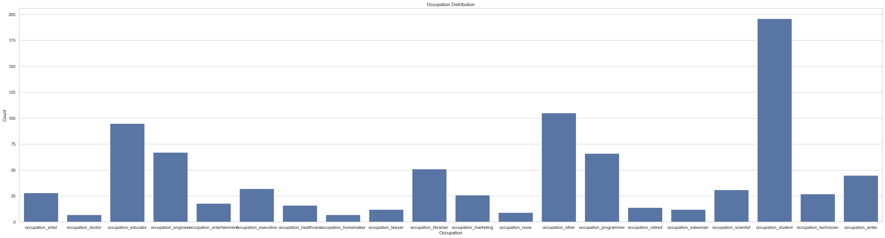
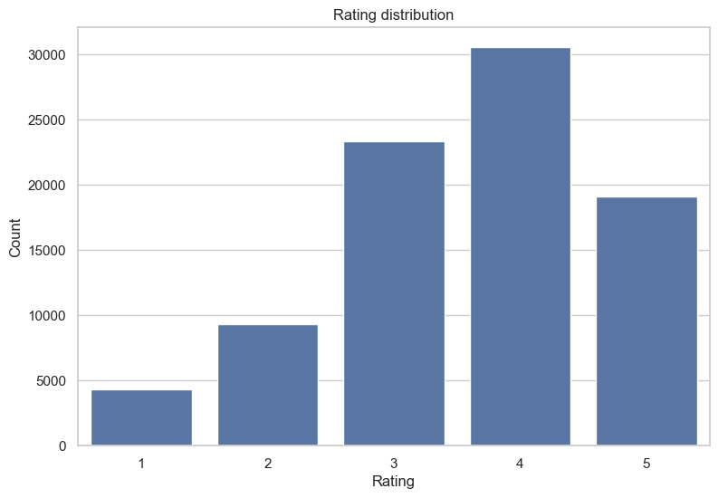
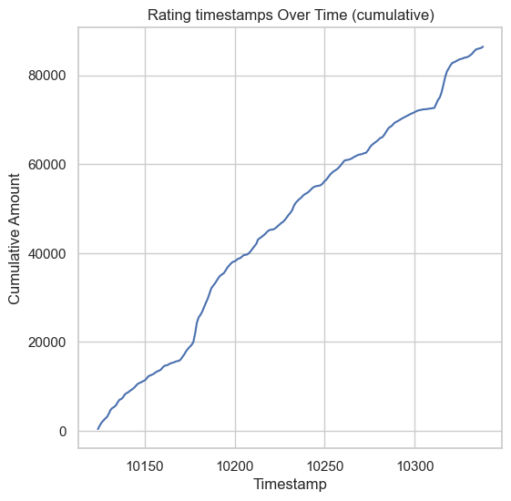
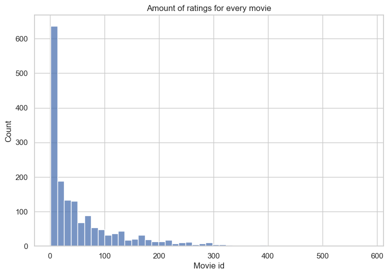
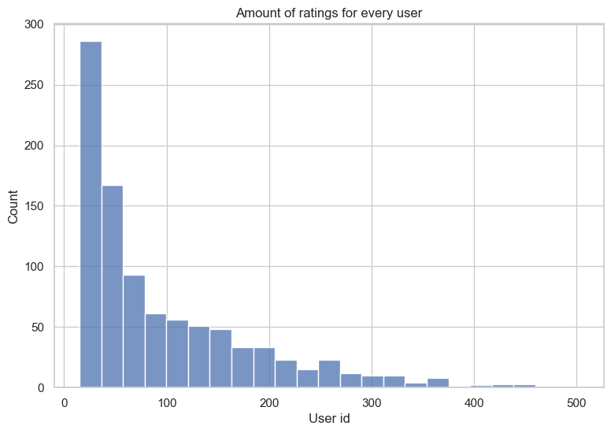
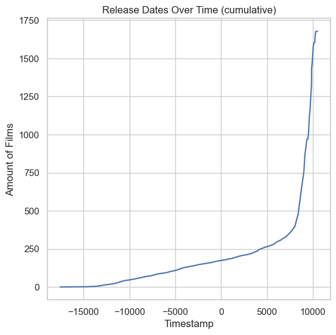

# Data analysis and exploration
 \
The age distribution appears satisfactory, but outliers exist among those who are too young or too old.

 \
The dataset contains a significant gender imbalance, with a higher number of male users. Despite this, a substantial number of female users are retained.

 \
Genre distribution indicates an adequate representation of movies in each genre. Movies with an unknown genre, occurring only twice, are removed.

 \
Occupation distribution in the dataset is sufficient for each occupation.

 \
Ratings are predominantly clustered around 3 and 4, indicating a common rating trend.

 \
The rating timestamps graph shows a smooth pattern.

 \
Distribution of ratings per movie reveals that some movies were rated very few times, prompting their exclusion from the dataset.

 \
Similarly, ratings per user distribution highlights some users with a minimal number of ratings, leading to their exclusion from the dataset.

 \
The release date distribution reveals outliers among movies that are either too old or too new, warranting their exclusion from the dataset.