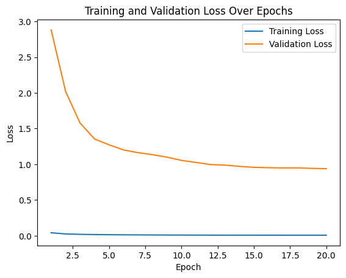
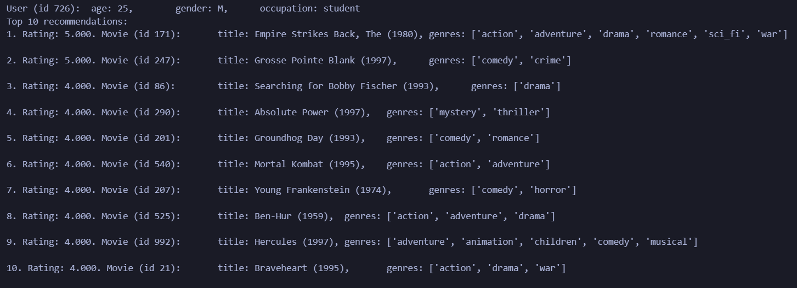
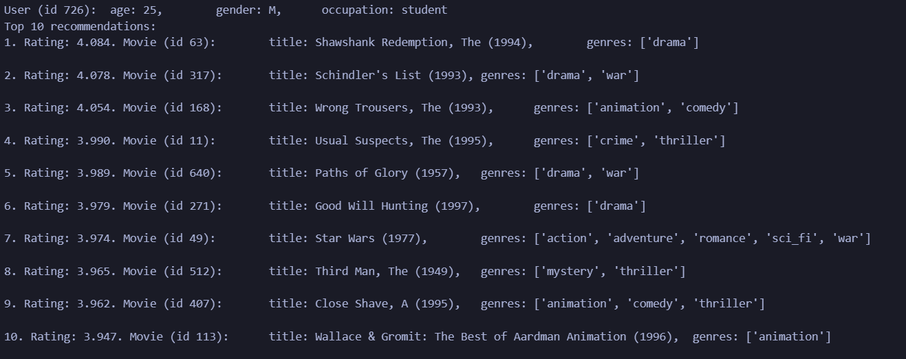
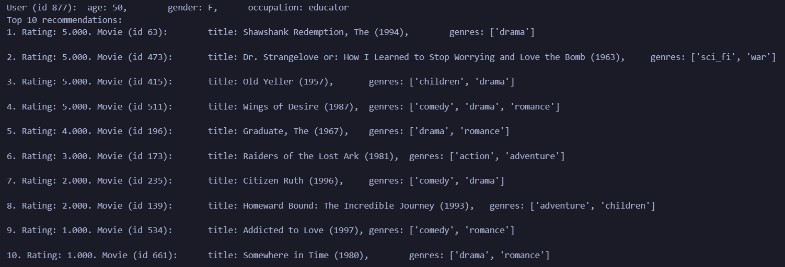
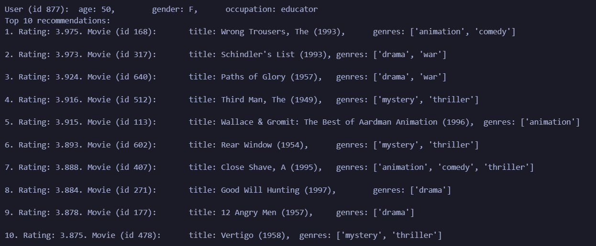

# Data analysis and exploration
 \
The age distribution appears satisfactory, but outliers exist among those who are too young or too old.

 \
The dataset contains a significant gender imbalance, with a higher number of male users. Despite this, a substantial number of female users are retained.

 \
Genre distribution indicates an adequate representation of movies in each genre. Movies with an unknown genre, occurring only twice, are removed.

 \
Occupation distribution in the dataset is sufficient for each occupation.

 \
Ratings are predominantly clustered around 3 and 4, indicating a common rating trend.

 \
The rating timestamps graph shows a smooth pattern.

 \
Distribution of ratings per movie reveals that some movies were rated very few times, prompting their exclusion from the dataset.

 \
Similarly, ratings per user distribution highlights some users with a minimal number of ratings, leading to their exclusion from the dataset.

 \
The release date distribution reveals outliers among movies that are either too old or too new, warranting their exclusion from the dataset.

### Insights from Data Analysis

1. Age Distribution: The majority of users fall within an acceptable age range, but outliers, particularly very young or old individuals, may skew the data.

2. Genre Representation: Each genre is well-represented in the dataset, with the removal of movies labeled as "unknown" due to their minimal occurrence.

3. Sparse Ratings per Movie: Movies with very few ratings are excluded to ensure a more robust dataset for analysis.

4. Limited Ratings per User: Users with a minimal number of ratings are excluded to enhance the reliability of user-based insights.

5. Release Date Impact: Movies deemed too old or too recent are excluded to focus on a more relevant timeframe for analysis.

# Model Implementation Details

The provided code represents a PyTorch implementation of a recommendation system model named RecSysModel. This collaborative filtering model incorporates both user and item embeddings along with additional user and item features for enhanced recommendation accuracy.

### Model Architecture:

* Embedding Layers: Embeddings were used capture the latent features in a lower-dimensional space of both users and items.

* Fully Connected Layers with dropout and batch normalization

### Model Advantages:

* Embedding Representation: Utilizes embeddings to capture latent features of users and items, enabling the model to learn intricate patterns and relationships.

* Incorporation of Additional Features: Includes user and item features in the recommendation process, enhancing the model's ability to make personalized recommendations.

* Dropout and Batch Normalization and Xavier Initialization: Integrates dropout layers and batch normalization, contributing to improved generalization and training stability. Xavier uniform initialization facilitates a more balanced and efficient training process.

* The model shows stable learning. Both train and validation losses are smoothly decreasing over time showing the common patter

### Model Disadvantages:

* Complexity: The model may be relatively complex, potentially requiring careful tuning of hyperparameters to prevent overfitting. I my case the gap between validation loss and train loss is very large.

* Providing additional features to the model may lead to paying too much attention to some features that mostly represented a good rate. As an example, genres that have more positive rates in general could be recommended even to people that are not interested in those genres

# Training Process
1. Prepare Data:
    * Organize your data into training batches, including user IDs, item IDs, user features, and item features. I have done this by writing my own class MovieDataset to create a dataset.
2. Initialize model:
    * Initialize model described above with suitable parameters
3. Define Loss Function and Optimizer:
    * Choose an appropriate loss function for your regression task. Since it's a recommendation system, Mean Squared Error (MSE) is a suitable choice.
    * Select an optimizer, I my case I have chose Adam as the most common solution.
4. Write and implement train loop and test loops:
    * Iterate over multiple epochs, where each epoch represents one complete pass through the entire dataset.
    * Since testing does not require much time, we can call test on every iteration.
    * If on some iteration results were successful, save them in the `models` folder
5. Tune hyperparameters:
    * Initially my model gave quite high test loss so I have tuned some hyperparameters to make my model easier to prevent overfitting.

### Evaluation

During training process only MSE were calculated used as both loss and metrics.

Once the model is finalized, its effectiveness is assessed on the test set using metrics like MAP at k and NDCG at k, offering insights into how well the model generalizes to new data and recommends items in a meaningful order.

### Why MAP at k and NDCG at k:

* These metrics are particularly relevant for recommendation systems where the focus is on the quality of the top-ranked items.
* They consider not only the presence of relevant items but also their ranking order, providing a more nuanced evaluation.

### Results
MAP score: 0.1794\
NDCG score: 0.2174

The obtained MAP score of 0.1794 and NDCG score of 0.2174 demonstrate positive aspects of the recommendation model. However, it's important to note that these scores are relatively low. The lower performance can be attributed to a high number of movies sharing the same rating, making it challenging for the model to distinguish and rank them effectively. Despite this challenge, the model still manages to provide meaningful recommendations, showcasing its potential for improvement with further optimization strategies.

### Recommendations Showcase
User 726:
* Watched Movies (Top 10):

* Top 10 Recommended Movies:

User 877:
* Watched Movies (Top 10):

*Top 10 Recommended Movies:

Explore additional cases in the latter part of the `2.0-final-solution.ipynb` notebook. These showcases highlight the personalized movie recommendations for individual users based on their watching history.